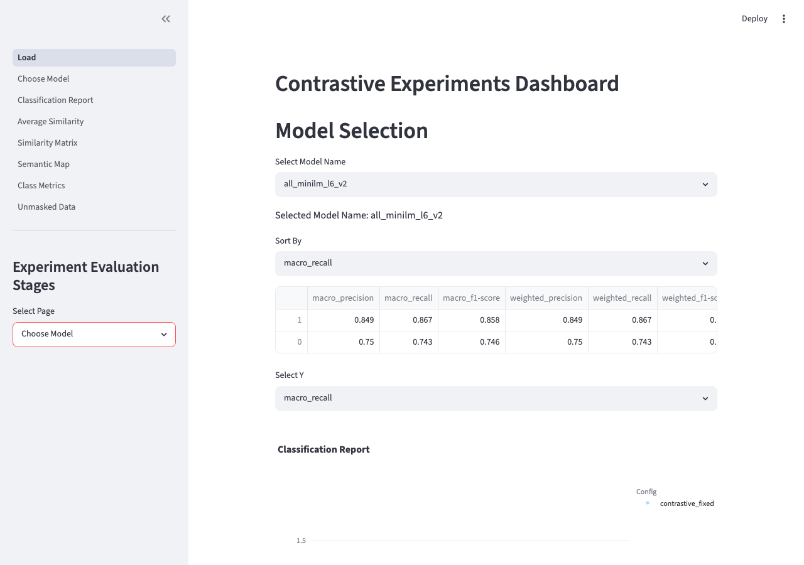
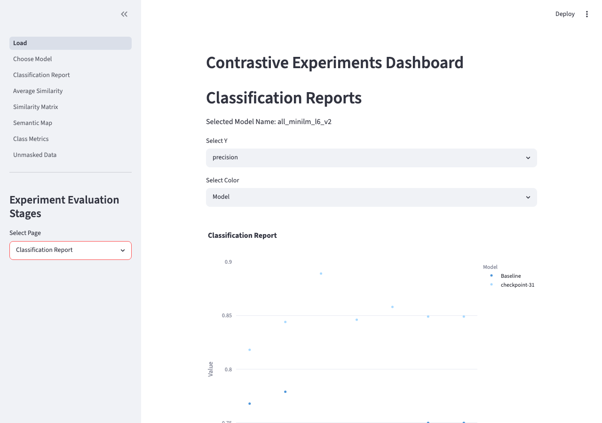
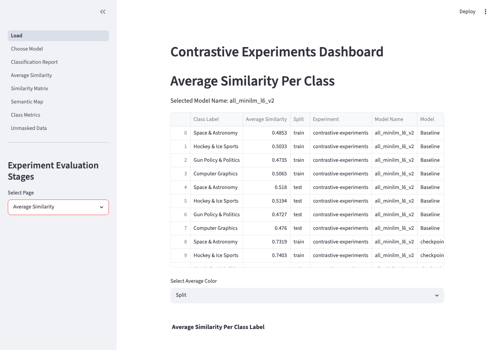
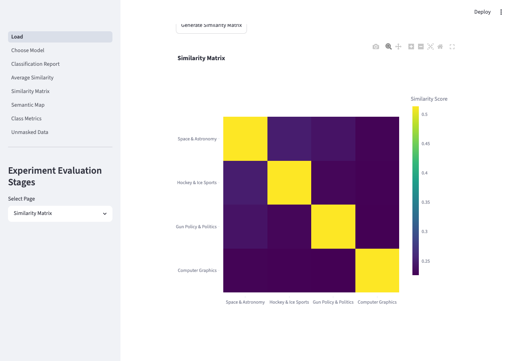
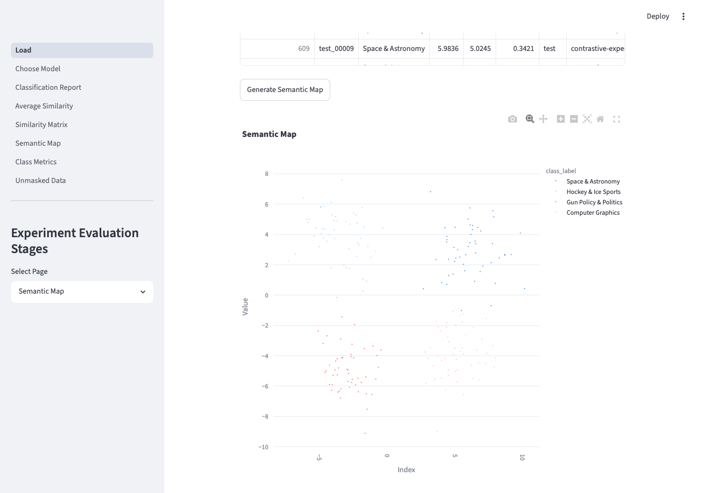
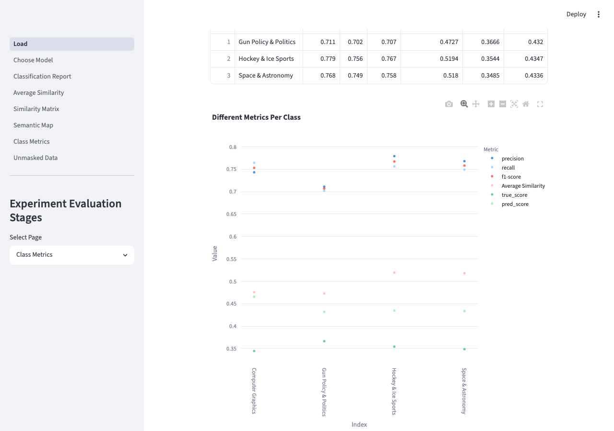
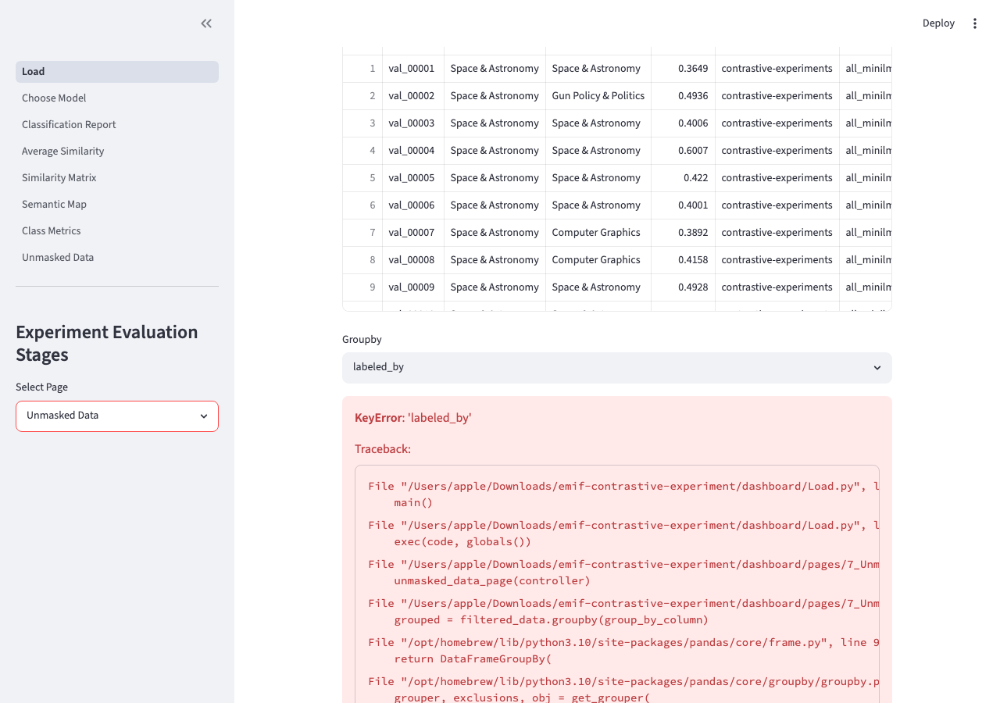

# contrastive-finetuning

A library for fine-tuning sentence transformers using contrastive learning, and evaluating the impact on topic cluster quality through a structured 5-stage pipeline and interactive dashboard.

## What this is for

Sentence transformers produce general-purpose embeddings. When applied to a specific domain — such as social media posts organised into topic clusters — those embeddings may group topics poorly: similar topics end up entangled, or dissimilar ones end up too close together in embedding space.

This library addresses that by fine-tuning the sentence transformer on the target domain using contrastive learning. The core idea: train the model to pull embeddings from the same topic class closer together (positive pairs) and push embeddings from different classes further apart (negative pairs, via `ContrastiveLoss`). The result is a domain-adapted embedding space with higher intra-cluster cohesion and greater inter-cluster separation.

After fine-tuning, the library runs a structured evaluation comparing the baseline model against the fine-tuned version across:
- Embedding cluster quality (UMAP visualisation, silhouette score)
- Intra-class cosine similarity
- k-NN classification accuracy using exemplar data

## Pipeline overview

The pipeline has five stages, each implemented as a workflow:

| Stage | Workflow | What it does |
|---|---|---|
| 1 | `TrainWorkflow` | Generates contrastive pairs from labelled data, fine-tunes a sentence transformer |
| 2 | `EmbeddingExtractionWorkflow` | Extracts embeddings from the baseline and fine-tuned models for train, validation, and exemplar sets |
| 3 | `ValidationWorkflow` | Produces semantic maps (UMAP), intra-class average similarity, and cross-class similarity matrices |
| 4 | `ClassificationWorkflow` | Trains a k-NN classifier on exemplar embeddings, classifies the full validation set |
| 5 | `ResultsWorkflow` | Aggregates all outputs into a consolidated results directory for the dashboard |

The Streamlit dashboard (`dashboard/Load.py`) reads from the consolidated results and provides interactive comparison across 7 pages: Choose Model, Classification Report, Average Similarity, Similarity Matrix, Semantic Map, Class Metrics, Unmasked Data.

## Contrastive pair generation

The `DataGenerator` class creates training pairs from labelled data. Two pair strategies:

- **`contrastive`** — positive pairs (same class, label=1) and negative pairs (different class, label=0), for use with `ContrastiveLoss`
- **`positive`** — positive pairs only, for use with cosine similarity loss

Two sampling methods:
- **`default`** — all pairwise combinations (exhaustive)
- **`stratified`** — fixed number of pairs sampled randomly, balanced across classes

## k-NN classification

The `KNNClassifier` uses a small set of hand-labelled exemplar documents to classify the full dataset. Exemplars are embedded using the (fine-tuned) sentence transformer; the classifier finds the k nearest exemplars by cosine similarity and assigns the most common label. This approach requires only a small number of labelled examples per class and benefits directly from the improved embedding space produced by contrastive fine-tuning.

The classifier outputs:
- Per-class precision, recall, F1 (classification report)
- Per-document prediction confidence (silhouette-based `pred_score`)
- Annotated validation dataset with predicted labels

## Config and reproducibility

Each training run is defined by a `TrainingConfig` dictionary. The config is hashed and the experiment is stored in a directory named by that hash — so identical configs are never run twice, and every result directory is self-contained with its `config.json`.

## Installation

Requires Python 3.10+.

```bash
git clone https://github.com/ay94/contrastive-finetuning.git
cd contrastive-finetuning
pip install -e .
```

## Data format

Three JSONL files are required under a `contrastive-data/` directory:

```
contrastive-data/
├── train.json       # Training data for pair generation and embedding extraction
├── validation.json  # Held-out data for evaluation and classification
└── exemplar.json    # Small labelled set for k-NN classifier training
```

Each file is newline-delimited JSON. Minimum required fields:

```json
{"messageId": "msg_001", "class_label": "topic_A", "text": "some text here", "topicId": "topic_A"}
```

To generate demo data using the 20 Newsgroups dataset (4 categories, ~800 records):

```bash
python scripts/create_demo_data.py
```

## Usage

### Full pipeline

```bash
python scripts/run_pipeline.py
# or with a custom base directory:
python scripts/run_pipeline.py --base-dir ~/my-experiments
```

### Step by step (notebooks)

Notebooks `00` through `05` in `notebooks/` walk through each pipeline stage individually. They are the primary interface for iterative experimentation — adjusting hyperparameters, inspecting intermediate outputs, and re-running individual stages. Notebook `06` is a utility for consolidating data splits and is not part of the main pipeline.

### On Colab

```python
from contrastive_experiment.utils import get_base_folder
base_folder = get_base_folder(colab_drive_path="/content/drive/Shareddrives/MyProject")
```

### Dashboard

Generate demo results without running training (for rapid visualisation):

```bash
python scripts/create_demo_results.py
streamlit run dashboard/Load.py
```

Or after a full pipeline run:

```bash
streamlit run dashboard/Load.py
```

### Dashboard screenshots

<table>
<tr>
<td><br><sub>Choose Model</sub></td>
<td><br><sub>Classification Report</sub></td>
</tr>
<tr>
<td><br><sub>Average Similarity</sub></td>
<td><br><sub>Similarity Matrix</sub></td>
</tr>
<tr>
<td><br><sub>Semantic Map</sub></td>
<td><br><sub>Class Metrics</sub></td>
</tr>
<tr>
<td><br><sub>Unmasked Data</sub></td>
<td></td>
</tr>
</table>

## Directory structure

```
contrastive-finetuning/
├── src/contrastive_experiment/   # Library
│   ├── workflows.py              # TrainWorkflow, EmbeddingExtractionWorkflow, etc.
│   ├── train_utils.py            # TrainingConfig, DataGenerator, Trainer
│   ├── eval_utils.py             # GeneralRepresentation, Evaluation (UMAP, similarity)
│   ├── classify_utils.py         # KNNClassifier
│   ├── results_utils.py          # Results consolidation, DataManager
│   └── utils.py                  # get_base_folder, initialise_structure
├── dashboard/                    # Streamlit dashboard
│   ├── Load.py                   # Entry point (streamlit run dashboard/Load.py)
│   ├── Utils.py                  # ExperimentData, DashboardView, ExperimentController
│   └── pages/                    # 7 analysis pages
├── notebooks/                    # Step-by-step experiment notebooks (00–06)
├── scripts/
│   ├── create_demo_data.py       # Generate 20 Newsgroups demo training data
│   ├── create_demo_results.py    # Generate plausible demo results for dashboard
│   └── run_pipeline.py           # End-to-end pipeline runner
├── tests/
└── pyproject.toml
```

## Testing

```bash
pip install pytest
pytest tests/
```

Four test modules covering core library components:

| Module | What it tests |
|---|---|
| `test_data_generator.py` | Pair generation — positive pairs, contrastive dataset structure, label correctness, sampling limits |
| `test_train_config.py` | `TrainingConfig` — init, save, and load from hashed directory |
| `test_embedding_extractor.py` | Embedding extraction workflow |
| `test_trainer.py` | Training workflow |

## Output structure

```
base_folder/
├── contrastive-data/
│   ├── train.json
│   ├── validation.json
│   └── exemplar.json
└── contrastive-experiment/
    └── <model_dir>/
        ├── baseline/
        │   ├── embeddings/
        │   ├── models/
        │   └── results/
        ├── contrastive_fixed/
        │   └── <config_hash>/     # Auto-generated from TrainingConfig
        │       ├── embeddings/
        │       ├── models/
        │       └── results/
        └── results/               # Consolidated — dashboard reads from here
```
